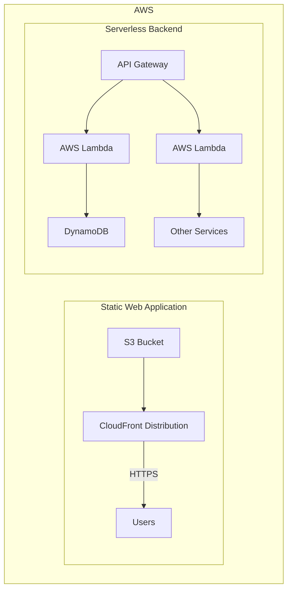

# AWS API Gateway

> Create Api endpoints.

[AWS API Gateway](https://aws.amazon.com/api-gateway/)

## Description

AWS api gateway is a service that allows you to create, publish, maintain, monitor, and secure APIs at any scale.

- Serverless
- Supports REST and WebSocket APIs
- Support for security, user authentication, API throttling, monitoring, API Keys, etc.

## Integration points

- Lambda Functions
- HTTP
- Mock
- AWS Service

## Features

- API Keys
- Custom Domain names
- CLient Certificates
- Deployment Stages (dev, prod)
- Authorizers (Authentication)
- Models: Schema of requests data that the API will receive for validation purpose.
- API Documentation
- BInary Support: for sending files.
- Logs Dashboard

## Use Cases

- REST API
- GraphQL API
- WebSockets API
- HTTP API

## Pricing

The pricing is based on the number of API calls received and the amount of data transferred out.
