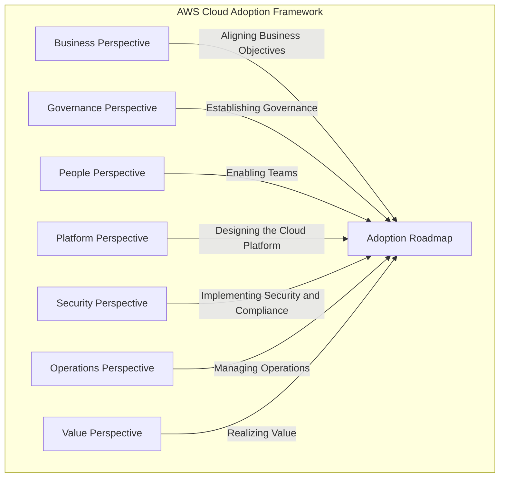

# AWS Cloud Adoption Framework

## Description

The AWS Cloud Adoption Framework (AWS CAF) provides guidance for coordinating the different parts of organizations migrating to the AWS Cloud. The framework is designed to help you build a comprehensive approach to cloud computing across your organization, and throughout your IT lifecycle.

## Perspectives

- [Business](aws-caf.md#business)
- [People](aws-caf.md#people)
- [Governance](aws-caf.md#governance)
- [Platform](aws-caf.md#platform)
- [Security](aws-caf.md#security)
- [Operations](aws-caf.md#operations)

### Business

This perspective ensures that IT aligns with business needs and that IT investments link to key business results

Common roles:

- Business Owners
- Finance Managers
- Budget Owners
- Strategy stakeholders

### People

This perspective evaluates organizational structures and roles, new skill and process requirements, and identify gaps. This helps prioritize training, staffing, and organizational changes.

Common roles:

- HR
- Staffing
- People Managers

### Governance

This perspective focuses on the skills and processes to align IT strategy with business strategy. This ensures that you maximize the business value and minimize risks.

Common roles:

- Chief Information Officer (CIO)
- Program Managers
- Enterprise Architects
- Business Analysts
- Portfolio Managers

### Platform

This perspective includes principles and patterns for implementing new solutions on the cloud, and migrating on-premises workloads to the cloud.

Common roles:

- Chief Technology Officer (CTO)
- Engineer

### Security

This perspective ensures that the organization meets security objectives for visibility, auditability, control, and agility.

Common roles:

- Chief Information Security Officer (CISO)
- IT Security Managers
- IT Security Architects

### Operations

This perspective helps to enable, run, use, operate and recover IT workloads to the level agreed with the business.

Common roles:

- IT Operations Managers
- IT Support managers

## CAF Action Plan

The AWS CAF Action Plan is a tool that helps you identify and address gaps in your cloud adoption plan. The Action Plan is a spreadsheet that you can download and use to track your progress as you implement the AWS CAF. The Action Plan is organized into three sections:

## The 6 R's of migration

### Rehosting

Rehosting is the process of migrating an application component to a cloud-based infrastructure without redesigning the application. This is also known as lift-and-shift.

Examples:

- Migrating a virtual machine to a cloud-based virtual machine
- Migrating a database to a cloud-based database

### Replatforming

Replatforming is the process of migrating an application component to a cloud-based infrastructure with some changes to improve performance, operations, or both. This is also known as lift-tinker-and-shift.

Examples:

- Migrating a database to a managed database service
- Migrating a web application to a managed container service

### Refactoring

Refactoring is the process of migrating an application component to a cloud-based infrastructure by rewriting or extending the code to use cloud-native features.

Examples:

- Migrating a monolithic application to a microservices architecture
- Migrating a batch processing application to a serverless architecture

### Repurchasing

Repurchasing is the process of migrating an application component to a different product or service. This is also known as drop and shop.

Examples:

- Migrating from an on-premises customer relationship management (CRM) system to a cloud-based CRM system
- Migrating from an on-premises enterprise resource planning (ERP) system to a cloud-based ERP system
- Migrating from an on-premises email system to a cloud-based email system

### Retaining

Retaining is the process of keeping an application component on-premises or in a hosting environment. This is also known as retain and retire.

Examples:

- Keeping an application component on-premises or in a hosting environment because of regulatory requirements
- Keeping an application component on-premises or in a hosting environment because of the cost of migration

### Retiring

Retiring is the process of removing an application component from use. This is also known as retain and retire.

Examples:

- Removing an application component from use because it is no longer needed
- Removing an application component from use because it is being replaced by a new application component

## Transformation domains

- Technology: Using the cloud to migrate and modernize legacy infrastructure, data, and applications.
- Process: Digitizing, automating and optimizing business operations.
- Organization: Reimagine operating models.
- Product: Reimagine business models.
