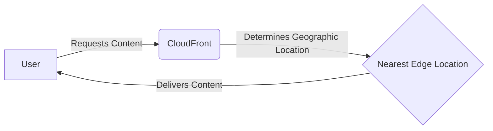

# CloudFront

## Description

Aws CloudFront serve as a caching system that will create a cdn on aws edge locations where it has been accessed, but also serves as a reverse proxy.

In short it will cache the content that has been requested and will serve it to the next user that requests it.

Examples:

- If a user from the US requests a file, it will be cached on the nearest edge location in the US.
