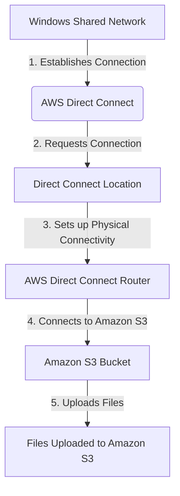

# AWS Direct Connect

## Description

AWS Direct Connect is a cloud service solution that makes it easy to establish a dedicated network connection from your premises to AWS. Using AWS Direct Connect, you can establish private connectivity between AWS and your datacenter, office, or colocation environment, which in many cases can reduce your network costs, increase bandwidth throughput, and provide a more consistent network experience than Internet-based connections.

- _It does not use public internet_

