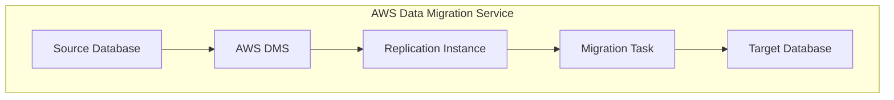

# Data Migration Service (DMS)

## Description

AWS DMS helps you migrate databases to AWS quickly and securely. The source database remains fully operational during the migration, minimizing downtime to applications that rely on the database. AWS DMS also supports ongoing replication to keep the source and target databases in sync as the source database is being migrated to AWS. You can migrate your data to and from most widely used commercial and open-source databases, such as Oracle, Microsoft SQL Server, and PostgreSQL. The service supports homogeneous migrations such as Oracle to Oracle, as well as heterogeneous migrations between different database platforms, such as Oracle to Amazon Aurora or Microsoft SQL Server to MySQL.

In short it is a service that helps you migrate data from one database to another.

## Supports

- Homogeneous migrations (Oracle to Oracle)
- Heterogeneous migrations (Oracle to Aurora)
