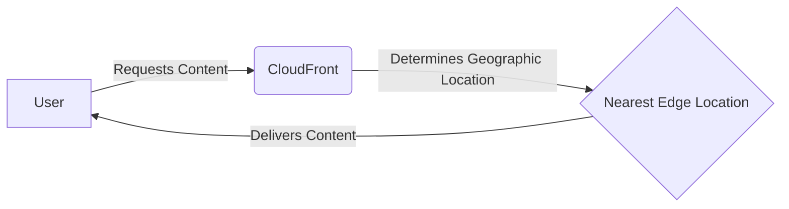

# CloudFront

## Description

Aws CloudFront serve as a caching system that will create a cdn on aws edge locations where it has been accessed, but also serves as a reverse proxy.

In short it will cache the content that has been requested and will serve it to the next user that requests it.

Examples:

- If a user from the US requests a file, it will be cached on the nearest edge location in the US.

AWS CloudFront is a CDN (Content Delivery Network) service that delivers static and dynamic web content, video streams, and APIs around the world.

- It improves read performance by caching content at the edge locations closest to the viewers. It also provides increased security and availability.
- DDoS (Distributed Denial of Service) protection because the content is served from multiple locations.

### Cloudfront as Reverse Proxy

Cloudfront can also be used as a reverse proxy, this is useful if you want to hide the origin server from the user.

## Origins

- S3 bucket
- EC2 instance
- Elastic Load Balancer
- Any HTTP server
