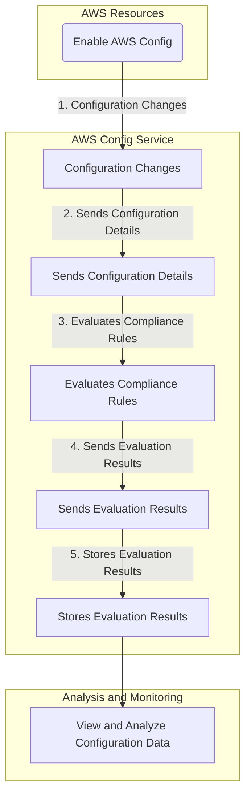

# AWS Config

> Where you can see your configuration changes over time.

## Description

AWS Config is a service that enables you to assess, audit, and evaluate the configurations of your AWS resources. Config continuously monitors and records your AWS resource configurations and allows you to automate the evaluation of recorded configurations against desired configurations. With Config, you can review changes in configurations and relationships between AWS resources, dive into detailed resource configuration histories, and determine your overall compliance against the configurations specified in your internal guidelines. This enables you to simplify compliance auditing, security analysis, change management, and operational troubleshooting.

In brief it is a service that monitors your AWS resources and records their configurations and allows you to automate the evaluation of recorded configurations against desired configurations.

Examples:

- You can use Config to monitor which AWS resources are associated with your application, such as EC2 instances, EBS volumes, and S3 buckets.

## Usage

In order to use AWS Config you need to enable it in your AWS account. You can do this by going to the AWS Config console and clicking on the "Get started" button. This will take you to a page where you can select the resources you want to monitor. You can also select the S3 bucket where you want to store the configuration history.

